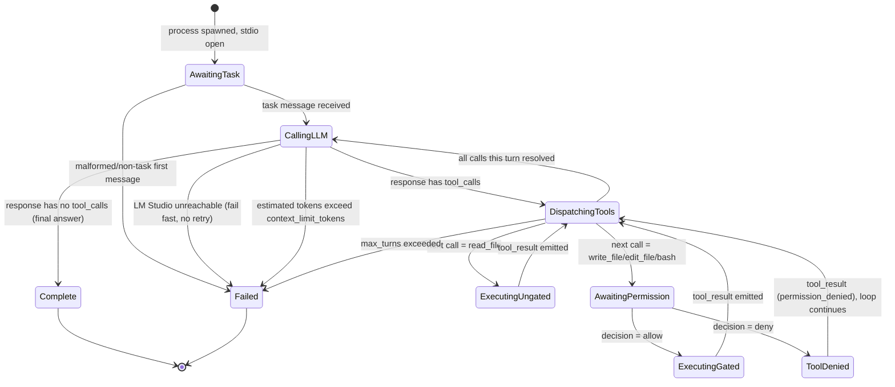

# Functional Specification

## 1. Objective

**Problem Statement**
Build a reusable, distributable CLI coding agent — a "harness" in the same category as Claude Code, the DeepSeek harness, and OpenCode — that runs headless as a **worker process spawned by an external orchestrator**, communicating over stdio rather than owning its own terminal UI. It executes coding tasks by driving a tool-calling loop against an LLM backend served locally through **LM Studio's OpenAI-compatible API**.

**Primary Objective**
Ship a minimal, correct agent-loop CLI that:
- Runs headless, spawned per-task by an external orchestrator, exchanging structured messages over stdio (exact wire protocol to be defined in Step 2)
- Drives an agentic tool-calling loop against LM Studio's local OpenAI-compatible endpoint
- Implements exactly four tool primitives: **file read, file write/edit, bash/shell execution**, plus the loop controller itself
- Gates every write/edit/bash call behind a **permission check** the orchestrator can approve or deny before execution
- Isolates the LLM backend behind a thin interface so the endpoint (currently LM Studio) is a config value, not something hardcoded into the loop — this is a seam for future providers, not multi-provider support itself

**Success Criteria (measurable)**
- [ ] An external orchestrator can spawn the CLI as a subprocess, hand it one task, and receive tool-call requests and results over stdio with zero direct terminal interaction
- [ ] The CLI completes a real end-to-end coding task against LM Studio (e.g. "implement function X, run the test suite, report pass/fail") using only the four core tools
- [ ] Every bash/write/edit call blocks on a permission-gate response from the orchestrator before executing
- [ ] Pointing the CLI at a different OpenAI-compatible endpoint requires only a config change, not a code change to the agent loop

**Out of Scope (v1)**
- Any LLM backend other than an OpenAI-compatible local endpoint (no native Claude/DeepSeek/OpenAI cloud SDK integration)
- Subagents or multi-agent spawning
- Hooks, skills/plugins, MCP support
- Persistent cross-session memory
- Context compaction / auto-summarization (single bounded-context session only)
- Any interactive terminal UI or REPL (the orchestrator owns the UI; this CLI is headless-only)
- Sandboxing or container isolation of tool execution (trusted local execution assumed)
- Auth / multi-tenancy (single local user, single orchestrator)

## 2. Inputs, Outputs & Interfaces

**Wire Protocol**
NDJSON over stdio: one JSON object per line. `stdin` carries orchestrator→agent messages, `stdout` carries agent→orchestrator messages. Six message types:

| Type | Direction | Purpose |
|---|---|---|
| `task` | orchestrator→agent | First message only; starts the loop |
| `tool_call` | agent→orchestrator | Announces an **ungated** call (`read_file`) — informational, non-blocking |
| `permission_request` | agent→orchestrator | Announces a **gated** call (`write_file`/`edit_file`/`bash`) — blocks execution |
| `permission_response` | orchestrator→agent | Answers a `permission_request`, correlated by `id` |
| `tool_result` | agent→orchestrator | Outcome of any tool call, gated or not |
| `task_complete` | agent→orchestrator | Terminal message — success or structured failure |

**Task Delivery**: the orchestrator spawns the CLI with no task-specific argv; the process opens stdio and waits. The first line it receives must be a `task` message.

**Message Schemas**

```json
// task (orchestrator → agent, must be the first line)
{
  "type": "task",
  "task_id": "string",
  "instructions": "string",
  "cwd": "string (absolute path)",
  "config": {
    "llm": { "base_url": "string", "model": "string", "temperature": "number?" },
    "max_turns": "integer",
    "context_limit_tokens": "integer"
  }
}

// tool_call (agent → orchestrator, read_file only, non-blocking)
{ "type": "tool_call", "id": "string", "tool": "read_file", "input": { "path": "string", "offset": "int?", "limit": "int?" } }

// permission_request (agent → orchestrator, write_file | edit_file | bash)
{ "type": "permission_request", "id": "string", "tool": "string", "input": { /* tool-specific, see below */ } }

// permission_response (orchestrator → agent)
{ "type": "permission_response", "id": "string", "decision": "allow | deny", "reason": "string?" }

// tool_result (agent → orchestrator, every call)
{ "type": "tool_result", "id": "string", "tool": "string", "success": "boolean",
  "output": "{...}?  // present iff success",
  "error": { "code": "string", "message": "string" } "// present iff !success" }

// task_complete (agent → orchestrator, terminal)
{ "type": "task_complete", "task_id": "string | null", "result": "success | failure",
  "summary": "string?  // final LLM answer, iff success",
  "error": { "code": "malformed_message | llm_unreachable | max_turns_exceeded | context_limit_exceeded | internal_error", "message": "string" } "// iff failure" }
```

**Tool I/O Contracts**

| Tool | Gated | Input | Output | Error codes |
|---|---|---|---|---|
| `read_file` | No | `path, offset?, limit?` | `content, truncated` | `not_found, is_directory, read_error` |
| `write_file` | Yes | `path, content` | `bytes_written, created` | `write_error, path_outside_cwd` |
| `edit_file` | Yes | `path, old_string, new_string, replace_all?` | `replacements_made` | `old_string_not_found, old_string_not_unique, write_error, path_outside_cwd` |
| `bash` | Yes | `command, cwd?, timeout_ms?` | `stdout, stderr, exit_code, timed_out` | `spawn_error, timeout` |

**LLM Backend Interface**: non-streaming `POST {base_url}/chat/completions` requests against LM Studio's OpenAI-compatible endpoint, using the OpenAI tool-calling schema for the `tools`/`tool_calls` fields so the four agent tools map 1:1 onto function definitions. `base_url` and `model` are config values (from the `task.config.llm` object), never hardcoded — swapping the backend requires only a different `base_url`.

## 3. Core Behaviors, State Transitions & Verification

**Permission Gate**: `write_file`, `edit_file`, and `bash` calls always emit `permission_request` and block — producing zero side effects — until a matching `permission_response` arrives, correlated by `id`. `read_file` calls are ungated: they emit `tool_call` and execute immediately without waiting on the orchestrator. When one LLM turn requests multiple tool calls, each gets a distinct `id`; a `permission_response` with an unmatched `id` is not applied to any pending call.

**Denial Behavior**: a `deny` decision produces `tool_result{success:false, error.code:"permission_denied"}`, which is fed back to the LLM as a normal tool result. The loop continues — denial does not abort the task.

**Failure Handling**:
- LM Studio connection error → immediate `task_complete failure/llm_unreachable`, zero retries (fail fast; the orchestrator owns any retry/restart policy).
- `max_turns` exceeded → `task_complete failure/max_turns_exceeded`, no further LLM calls made.
- Estimated token count for the next request exceeds `context_limit_tokens` → `task_complete failure/context_limit_exceeded`, checked before the LM Studio call is sent (no compaction in scope).
- Malformed first message (not `type: "task"`) → `task_complete failure/malformed_message` with `task_id: null`, process exits non-zero.

**State Diagram**



**Validation Criteria**

1. NDJSON lines are buffered/reassembled correctly across partial stdin reads.
2. First non-`task` message → immediate `task_complete` failure (`malformed_message`), non-zero exit.
3. `read_file` never blocks on orchestrator input.
4. Gated tools produce zero side effects before their matching `permission_response` arrives.
5. Multiple tool calls in one LLM turn get distinct `id`s; a `permission_response` with an unmatched `id` is not applied to any pending call.
6. Denial → `tool_result{success:false, error.code:permission_denied}` fed back to the LLM; loop continues, task does not abort.
7. `max_turns` exceeded → `task_complete failure/max_turns_exceeded`, no further LLM calls.
8. Estimated tokens over `context_limit_tokens` → fail fast with `context_limit_exceeded` before the LM Studio call is sent.
9. LM Studio connection error → immediate `task_complete failure/llm_unreachable`, zero retries.
10. A local mock HTTP server implements `POST /v1/chat/completions`; tests assert outgoing request shape and correct handling of returned `tool_calls`.
11. A scripted fake-orchestrator integration test drives a full `task → (tool_call|permission_request) → permission_response → tool_result → task_complete` sequence against the mock LLM and a real temp directory, exercising all four tools + the permission gate together.
12. Pointing `config.llm.base_url` at a second mock server requires no code change — same suite passes against both, proving the backend-swap success criterion.
